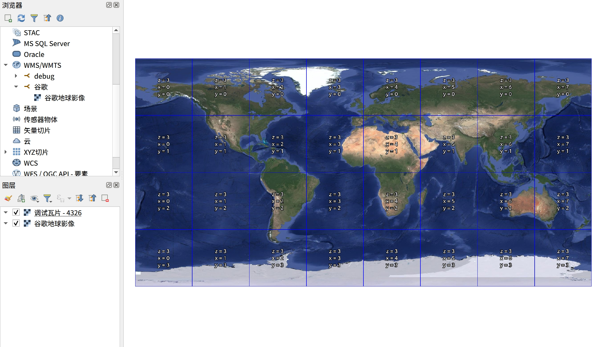

# GE_WMTS

谷歌地球影像 WMTS 服务

与谷歌地图卫星影像 (`https://mt1.google.com/vt/lyrs=s&x={x}&y={y}&z={z}`) 相比:  
- 无水印
- 时间更新
- 更清晰?

## 进度
 - [x] 影像解密
 - [x] 四叉树编码➡️XYZ行列号（经纬度投影）
 - [x] WMTS 服务
 - [ ] qtree解析（如何确定瓦片版本号）
 - [ ] 历史影像
 - [ ] 缓存

## 调试运行

```bash
deno task dev
```

QGIS 加载效果



## 参考资料

1. 瓷砖名称的形成原理 --- Принцип формирования имён тайлов[EB/OL]. https://greverse.bitbucket.io/genames.htm.
2. 有关 dbRoot.v5 文件的详细信息 --- Подробно о файле dbRoot.v5[EB/OL]. https://greverse.bitbucket.io/dbroot.htm.
3. 谷歌地球瓦片下载分析（未完） - 暗鸦 - 博客园[EB/OL]. https://www.cnblogs.com/utopin/p/14691863.html.
4. Google Earth影像数据破解之旅 - fu*k - 博客园[EB/OL]. https://www.cnblogs.com/fuckgiser/p/6424207.html.
5. qtree文件结构解析(二) - janehlp - 博客园[EB/OL]. https://www.cnblogs.com/janehlp/p/13695688.html.

